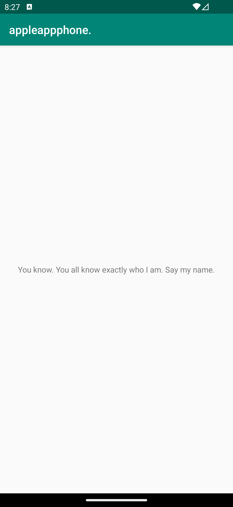

# Rapport

**Skriv din rapport här!**
I den här appen har vi ändrat på text utifrån en "färdigbyggd" applikation. 

Uppgiften var att ändra texten "hello" till något annat.

Appnamnet hämtas från:
```
android:label="@string/main_text"
```

Appinnehållets text hämtas från:
```
android:label="@string/app_name"
```

Här är koden för stringsen:
```
<resources>
    <string name="app_name">You know. You all know exactly who I am. Say my name.</string>
    <string name="main_text">appleappphone.</string>
</resources>
```

Appen ser ut så här:


